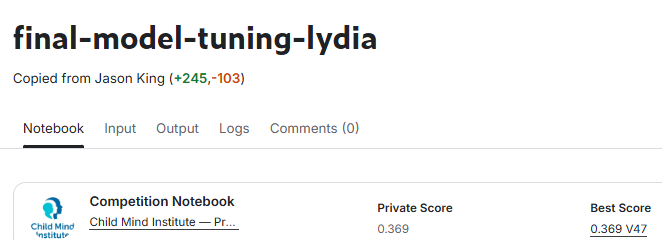
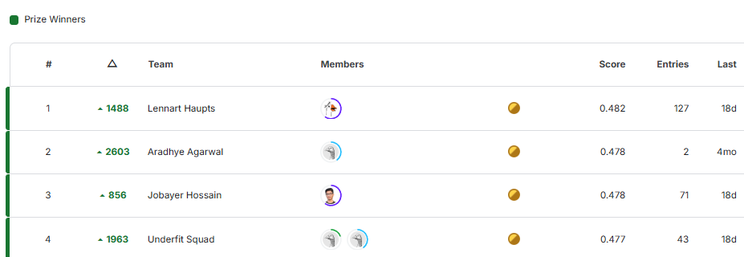
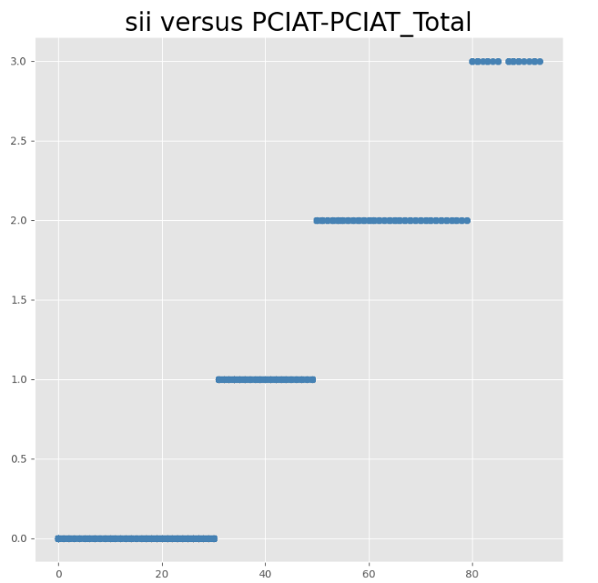
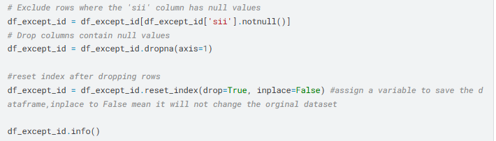
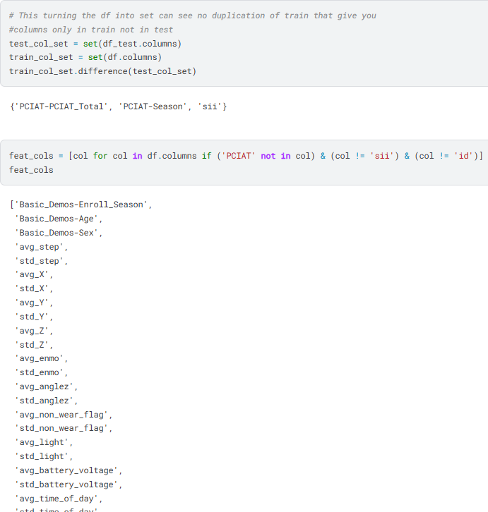
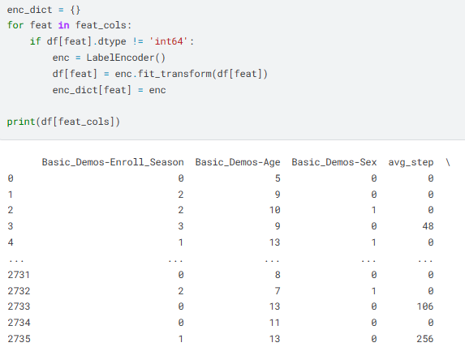
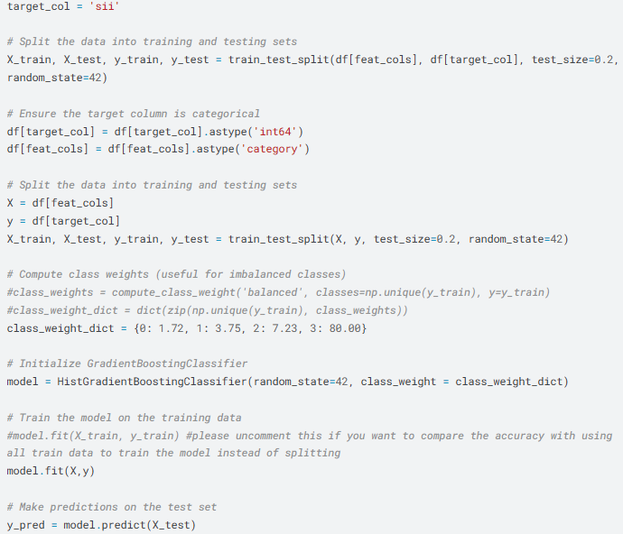
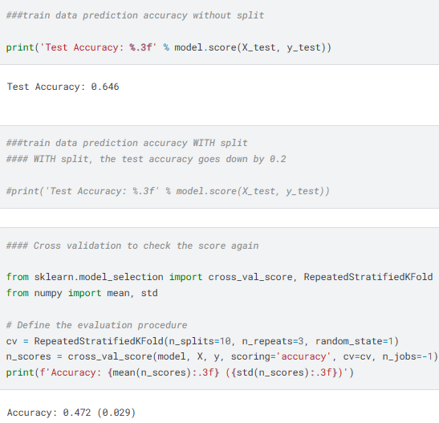

# Kaggle Competition - Child Mind Institute: Problematic Internet Use

## Project Overview
I participated in the Child Mind Institute's Kaggle competition, where the objective was to build a predictive model capable of identifying early indicators of problematic internet use in children based on their physical activity data. The competition involved complex datasets, challenging both data preprocessing and model optimization skills.

## Results
I achieved a 37% accuracy score compared to the highest score of 48%, positioning my performance at approximately 77% of the top leaderboard score. This competition's challenging nature made even modest improvements significant and rewarding.

## Project Objectives
The primary goal of this project was to:

Analyze descriptive data and physical activity data of children.

Develop a predictive model for the problematic internet use indicator (SII).

Demonstrate skills in data preprocessing, feature engineering, and model evaluation.

## Collaboration and Learning

This was my first machine learning competition, involving significant collaboration and learning. I worked with:

Jason (Data Science Director, Nashville, TN): Guided on data exploration, model structuring, and code management best practices.

Shashi (Software Developer, Nepal): Co-learned from the book Python Machine Learning by Sebastian Raschka & Vahid Mirijalili, focusing on foundational algorithms and best practices.

Key Takeaways:

Importance of data exploration before modeling.

Structuring code with clear documentation and version control.

Balancing the need for clean code with experimentation.

## Data Exploration and Cleaning

Key Steps:

Target Variable Relationship: The sii field showed a strong correlation with the PCIAT fields, indicating a positive relationship.

Handling Missing Values:

Dropped rows with null values in the sii column (around 30% missing). Dropped columns with null values for data simplication.

Feature Engineering:

Created statistical summaries for time-series data (e.g., mean, median, standard deviation).

Appended these summaries to the main dataset to avoid data duplication.

## Data Preparation for Machine Learning

Steps Taken:

Dataset Alignment: Compared training and test datasets to ensure consistent feature sets.

Encoding: Applied LabelEncoder() to transform categorical data into numerical values.

Target Column Balancing: Adjusted class weights manually to address imbalance.

Splitting: Training data was split into feature and target sets without standard train-test splits due to data limitations.

## Model Selection and Performance

Model Used: HistGradientBoostingClassifier() chosen for its ability to handle missing values effectively.

Performance:

Test Accuracy: 65%

Cross-validation score: 47.2%, indicating slight overfitting.

## Further Analysis and Next Steps

Implement strategies to handle missing data more selectively.

Explore alternative techniques such as imputing with labeled values.

Refine feature engineering techniques further.

